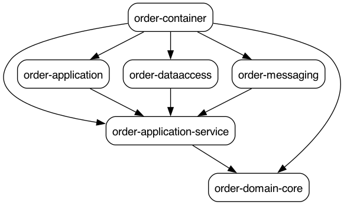

Food Ordering System

Tags:
Spring Boot
Microservices
Clea Architecture
Hexagonal Architecture
DDD
SAGA
Outbox
CQRS
Kafka
Kubernetes
GKE

mvn com.github.ferstl:depgraph-maven-plugin:aggregate -DcreateImage=true -DreduceEdges=false -Dscope=compile "-Dincludes=com.femow*:*"
